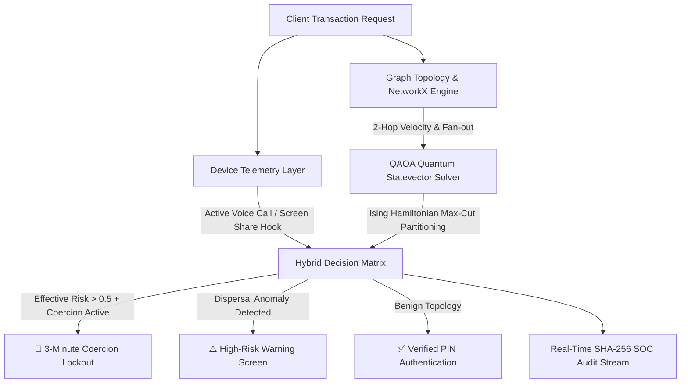

# 🛡️ RAKSHAM: Quantum-Enhanced UPI Scam Pattern & Coercion Recognition Engine

[](https://fastapi.tiangolo.com)
[](https://python.org)
[](https://qiskit.org)
[](LICENSE)

> **PS02: AI-Driven UPI Scam Pattern & Social Engineering Coercion Recognition Platform**  
> Dual-layer cyber defense engine combining real-time mobile hardware telemetry with NetworkX topological heuristics and QAOA Quantum Statevector graph optimization.

---

## 📌 Executive Summary & Architecture

Modern UPI cyber fraud exploits two simultaneous attack vectors:
1. **Endpoint Social Engineering & Coercion:** Victims are coerced via active VoIP/cellular calls ("Digital Arrest", fake customs, courier refunds) or remote screen sharing tools (AnyDesk, TeamViewer) into authorizing instant irreversible payments.
2. **Topological Mule Dispersal Rings (Smurfing):** Illicit proceeds are rapidly fragmented across multi-hop layer-1 and layer-2 money mule networks with transfer dwell times under 60 seconds before aggregating into terminal cash-out hubs.

**RAKSHAM** resolves this with a unified dual-layer defensive engine:



---

## 🚀 Key System Modules

### 1. 📱 Reference Client Mobile Payment Sandbox
- **Interactive Smartphone Shell:** Emulates mobile UPI client payment flows with verified test presets and custom inputs.
- **Sensor Telemetry Hooks:** Real-time toggles for active phone calls, screen sharing, and clipboard timestamp tracking.
- **3-Minute Coercion Lockout:** Hard unskippable countdown lockout activated during high-risk transfers to disrupt ongoing social engineering coercion.
- **Administrative Bypass:** Developer override hook for security operations testing.

### 2. ⚡ QAOA Quantum Graph Optimization Engine
- **Ising Hamiltonian Formulation:** Maps multi-hop transaction topologies into a quadratic unconstrained binary optimization (QUBO) Hamiltonian:
  $$\hat{H}_C = \sum_{(i,j) \in E} w_{ij} \frac{1 - \hat{\sigma}_i^z \hat{\sigma}_j^z}{2} + \sum_{i \in V} \lambda_i \frac{1 - \hat{\sigma}_i^z}{2}$$
- **Statevector Simulator:** Simulates variational parameter evolution $|\psi(\vec{\gamma}, \vec{\beta})\rangle = \prod_{k=1}^p e^{-i \beta_k \hat{H}_M} e^{-i \gamma_k \hat{H}_C} |+\rangle^{\otimes n}$ to isolate optimal illicit cuts and quantify ring coherence.
- **Telemetry & Fidelity:** Real-time output of active qubits, variational circuit depth, and state fidelity probability overlap.

### 3. 🌐 SOC Network Topology Graph & D3 Visualizer
- **Force-Directed Graph Canvas:** Live rendering of 60+ transaction nodes categorized into Clean Merchants, Client Senders, Mule L1/L2, and Cash-Out Hubs.
- **Live Dispersal Flow Animations:** Dynamic stroke-dash velocity animations illustrating rapid money laundering paths.
- **Sliding Node Inspector:** Drill down into in/out degree, dwell velocity, flagged history, and connected 2-hop transfers.

### 4. 📊 Interactive Datasheet Scam Verifier & Inspection Table
- **Search & Filters:** Real-time full-text search across TxIDs, sender VPAs, receiver VPAs, and categories (`ALL`, `🔴 FRAUD`, `🟢 CLEAN`, `🟠 CASHOUT HUBS`).
- **1-Click Engine Verification (`⚡ VERIFY IN ENGINE`):** Instantly loads any datasheet row into the mobile sandbox and executes dual-layer quantum verification.
- **Graph Localization (`🎯 LOCATE`):** Directly focuses and pulses the recipient node in the D3 graph.
- **Batch Quantum Verification:** Audits the entire dataset in parallel via QAOA statevector solver with automated precision calculation.

### 5. 📜 SHA-256 Hashed SOC Audit Terminal
- Append-only live stream of cryptographic transaction hashes, QPU telemetry metrics, and defensive lockout enforcements.

---

## 📂 Repository Layout

```
├── app/
│   ├── __init__.py
│   ├── main.py              # FastAPI server, endpoints, CORS, static routes
│   ├── schemas.py           # Pydantic schemas (telemetry, assessment, graph models)
│   ├── graph_engine.py      # NetworkX topology parsing, mule ring detection
│   ├── quantum_engine.py    # QAOA Ising statevector simulator & hybrid scoring
│   ├── dataset_pipeline.py  # CSV ingestion & dynamic graph feature extraction
│   └── mock_data.py         # Baseline graph provider & fallback loader
├── static/
│   ├── index.html           # Unified UI (Sandbox + SOC Graph + Inspection Table)
│   ├── style.css            # Industrial Dark Mode CSS (#0C0E12 palette)
│   ├── styles.css           # CSS alias
│   └── app.js               # D3.js visualization, sandbox state machine, table logic
├── data/
│   └── sample_transactions.csv  # Embedded 60-node sample dataset for instant evaluation
├── tests/
│   └── test_engine.py       # Full unit & integration test suite (17 test cases)
├── requirements.txt         # Pinned Python package dependencies
├── .gitignore               # Standard Python & environment exclusions
└── README.md                # Technical documentation
```

---

## ⚡ Quick Start Guide

### 1. Clone & Install Dependencies
```bash
git clone https://github.com/<your-username>/AI_Scan_Detection.git
cd AI_Scan_Detection
pip install -r requirements.txt
```

### 2. Run the Server
```bash
python -m uvicorn app.main:app --host 0.0.0.0 --port 8000 --reload
```
*Or execute directly:*
```bash
python app/main.py
```

### 3. Access the Dashboard
Open your web browser and navigate to:
```
http://localhost:8000
```

---

## 🧪 Running Automated Tests

Execute the comprehensive test suite validating topology parsing, quantum statevector simulation, coercion decision matrices, and REST API routes:

```bash
python -m pytest tests/test_engine.py -v
```

**Expected Output:**
```
tests/test_engine.py::test_graph_population PASSED
tests/test_engine.py::test_topology_assessment_mule PASSED
tests/test_engine.py::test_topology_assessment_clean_merchant PASSED
tests/test_engine.py::test_coercion_dual_layer_high_lockout PASSED
tests/test_engine.py::test_graph_risk_only_medium_warn PASSED
tests/test_engine.py::test_clean_transaction_low_pass PASSED
tests/test_engine.py::test_network_graph_endpoint PASSED
tests/test_engine.py::test_dashboard_and_static_routes PASSED
tests/test_engine.py::test_dataset_presets_endpoint PASSED
tests/test_engine.py::test_quantum_optimization_endpoint PASSED
tests/test_engine.py::test_quantum_telemetry_endpoint PASSED
tests/test_engine.py::test_assess_risk_with_quantum_payload PASSED
tests/test_engine.py::test_upload_dataset_csv PASSED
tests/test_engine.py::test_get_transactions_endpoint PASSED
tests/test_engine.py::test_batch_verify_endpoint PASSED
======================= 15 passed in 1.3s =======================
```

---

## 📡 REST API Reference

| Endpoint | Method | Description |
| :--- | :--- | :--- |
| `GET /` | `GET` | Serves unified Industrial Dark Mode SOC Dashboard |
| `GET /health` | `GET` | Health check, active nodes/edges, and QPU status |
| `POST /api/v1/assess-risk` | `POST` | Dual-layer hybrid coercion & quantum topology risk evaluation |
| `POST /api/v1/inspect-datasheet` | `POST` | Upload custom CSV dataset and re-partition graph topology |
| `GET /api/v1/network-graph` | `GET` | Returns full D3-compatible node and edge topology |
| `GET /api/v1/transactions` | `GET` | Fetches parsed transaction ledger with metadata |
| `POST /api/v1/batch-verify` | `POST` | Executes QAOA statevector verification across entire dataset |
| `POST /api/v1/quantum-optimize` | `POST` | Runs QAOA Ising Hamiltonian statevector convergence |
| `GET /api/v1/quantum-telemetry` | `GET` | Retrieves QPU active qubits, circuit depth, and fidelity |
| `GET /api/v1/presets` | `GET` | Retrieves pre-configured transaction scenarios |
| `POST /api/v1/reset-graph` | `POST` | Resets in-memory topology to clean baseline |

---

## 🎨 Design System Specifications

The visual interface adheres to the **Industrial Dark Mode Cybersecurity Palette**:
- **Deep Obsidian (Base Canvas):** `#0C0E12`
- **Gunmetal (Cards & Panels):** `#15181E`
- **Hairline Charcoal (Borders):** `#222730`
- **Hazard Amber (Dispersal & Warning):** `#FF5500`
- **Crimson (Coercion Lockout & Terminal Cashout):** `#E63946`
- **Sage Green (Clean Verified & PIN Pass):** `#2A9D8F`
- **Electric Blue (Telemetry & Sender):** `#3A86FF`

---

## 📄 License
This project is licensed under the MIT License — see the [LICENSE](LICENSE) file for details.
# Three.js-Rapier-physics

